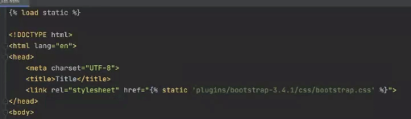
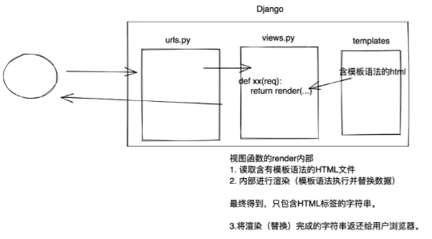
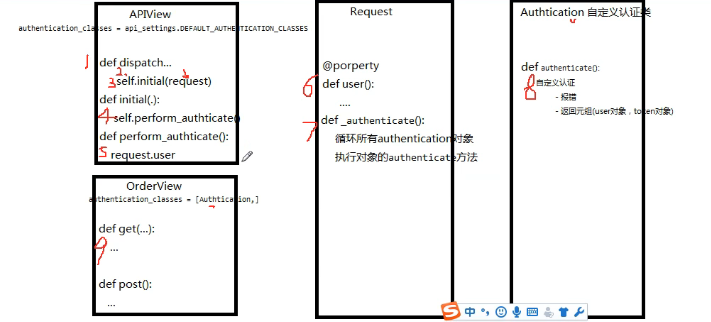

## 学习Django
### 新建project
* django-admin startproject project名称
    * 目录结构
### 新建app
* python manage.py startapp app名称（pycharm可以运行manage即可）
  * 目录结构
* settings.py 中找到INSTALLED_APPS这一项，添加新建的app，如下：
```
 INSTALLED_APPS = (
    'django.contrib.admin',
    'django.contrib.auth',
    'django.contrib.contenttypes',
    'django.contrib.sessions',
    'django.contrib.messages',
    'django.contrib.staticfiles',
    'web.apps.WebConfig'
    'app名称',               
    )
```
* 编写URL和Views函数对应的关系urls.py
* 编写Views视图函数
* 启动django项目
  ```Python manage.py runserver ```
### templates模板
* 固定写法，调用HTML模板```return render(request, 'user_list.html')```
  *默认是app文件夹，(根据app的注册顺序，逐一去他们的templates目录中找,可配置)
### 静态文件
* 在app目录下创建static文件夹
* 在页面中引用，有默认做法,在页面顶部
```

```



### 模板语法
* 本质上：在HTML中写一些占位符，由数据对这些占位符进行替换和处理。
* 
* Ajax
  * 可以使用ModelForm自动生成表单
  * 一般获取Json数据，
    * 成功信息，
    * 失败信息，循环得到对应的错误信息（HTML的ID，会等于id_字段名称）
### 数据库
* 引用库MySQLdb
* ORM
  * 创建，修改，删除数据库中的表
  * 操作表中的数据
  * Django设置,settings.py
    ```
    DATABASES = {
        'default': {
            'ENGINE': 'django.db.backends.mysql',
            'NAME':  'test',
            'USER': 'root',
            'PASSWORD': 'Aa123456',
            'HOST': '127.0.0.1',
            'PORT': 3306
        }
    }
* 创建表结构
`python manage.py migrate`
* 让 Django 知道我们在我们的模型有一些变更
`python manage.py makemigrations app名称`
* 创建表结构
`python manage.py migrate app名称`
* 已有的数据库,反向生成表结构
`python manage.py inspectdb models.py`
* 
* 创建超级用户
`python manage.py createsuperuser`
* ORM操作
* ModelForm 和 Form组件，在我们开发增删改查功能
  * 生成HTML标签
    * 外键关联，如果直接使用queryset的是可以直接获取到外建关联的对应的表的名称等信息
  * 请求数据进行校验
  * 保存到数据库
    * form.instance.字段名称 = 'XXX'(可在后台自动生成的字段数据)
    * modelform上传文件是自动，不过需要配置media文件夹
    * form上传，需要重新操作文件
  * 获取错误信息
* Cookie和Session，用户登录信息保存
  * Cookie是服务端给客户端的秘钥
  * Session是用户信息
* 中间件，基于中间件实现用户认证
  * 最多五个方法


### restful规范
* API与用户通信协议，大部分使用HTTPS协议
* URL规范
  * 域名www.xxx.com/api
  * 版本www.xxx.com/api/v1
* 路径使用名词
* method--CBV
* 过滤--筛选条件
* 状态码--提示
  * 200,300,403,500等等
* 错误处理
* 返回结果
* hypermedia api--自动在返回数据添加URL信息

### Django rest framework框架
* 验证---dispatch
* 源码流程
  * 面向对象
    * 分装
      * 相同的方法属性封装到类中
      * 通过构造方法将数据封装到对象中
    * 继承
      * 两个类相同部分可以提取到基类，并再继承使用
    * 多态
* 认证
  * 有自带认证规则
  * 类中写静态字段
    `authentication_classes=[Authtication]`
  * 
  * 返回值
    * None 不管
    * 异常 抛出异常
    * 元组 两个元素
      * request.user
      * request.Auth
  * 全局设置
  ```
    # 在setting中设置
    REST_FRAMEWORK = {
      'DEFAULT_AUTHENTICATION_CLASSES':['路径.文件名.类名',''],
      'UNAUTHENTICATED_USER':None,
      'UNAUTHENTICATED_TOKEN':None,
  }
    # 如不用认证，重新赋值为空
    authentication_classes=['']
  ```
  * drf内置认证BaseAuthentication
    * 源码流程 
      * dispatch
        * -封装request  
          * -获取定义的认证类（全局/局部），通过列表生成时创建对象. 
        * -initial 
          * perform authentication 
            * request.user(内部循环)
* 权限
  * 类中写静态字段
  * `permission_classes = [Mypermission]`
  * 返回值
    * True 有权限
    * False 无权限
  * 全局引用
  ```
  REST_FRAMEWORK = {
      # 全局使用权限类
      "DEFAULT_PERMISSION_CLASSES": ['api.utils.permission.MyPermission'],
  }
  ```
  * 源码流程
* 节流
  * 类中写静态字段
    `throttle_classes = [VisitThrottle,]`
  * 返回值
    * True 为到限制次数
    * False 已到限制次数
* 版本
* 解析器
* 序列化
  * 请求数据进行校验
  * Queryset进行序列化
* 分页
* 路由
* 视图
* 渲染器